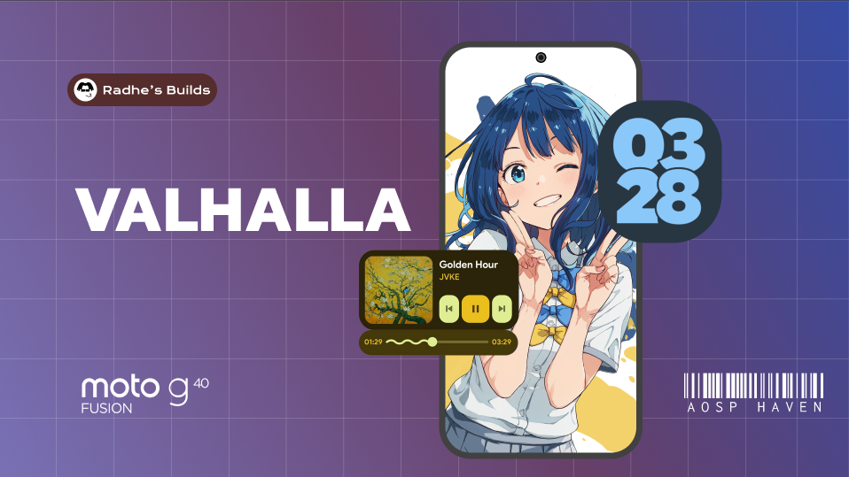

# You think we're gonna like it

Heyya, Welcome to Isg32's Aosp-Valhalla Project - I just wanted to make a usable A15 ROM so here we are, if this still works - welcome.

This is based on Project Styx as a base and Yaap as for google goodies.

> The Styx Project is a simple, clean, beautiful Android based custom ROM that strives to provide a stable and fluid experience, with minimal enhancements and features to bring out the most out of your Android device.

To get started , you'll need to get
familiar with [Repo](https://source.android.com/source/using-repo.html) and [Version Control with Git](https://source.android.com/source/version-control.html).

**Initializing the manifest.**

```
repo init -u https://github.com/Android-Valhalla/manifest -b vic
```

**Syncing the source.**

```
repo sync -j$(nproc --all) --force-sync --no-tags --no-clone-bundle --prune --optimized-fetch
```

**Building.**

```
source build/envsetup.sh
lunch devicecodename-ap3a-user
m styx-ota
```

**Contact.**

If you're interested talking to me, You're welcome at [@semisapeol](https://t.me/semisapeol)